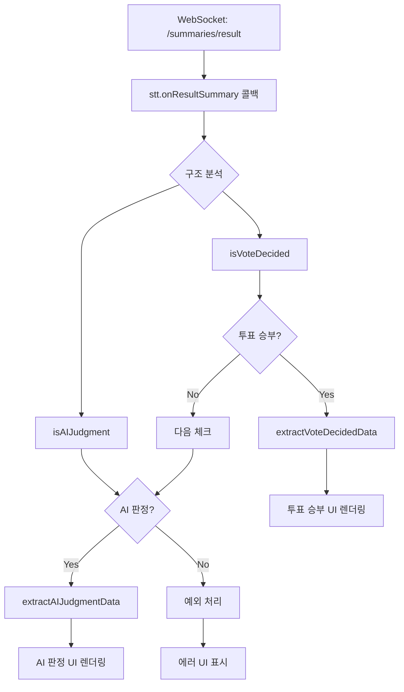
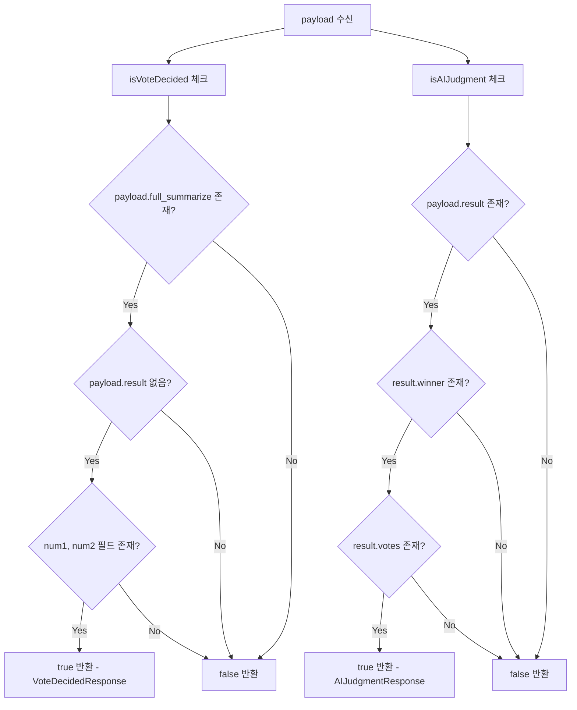
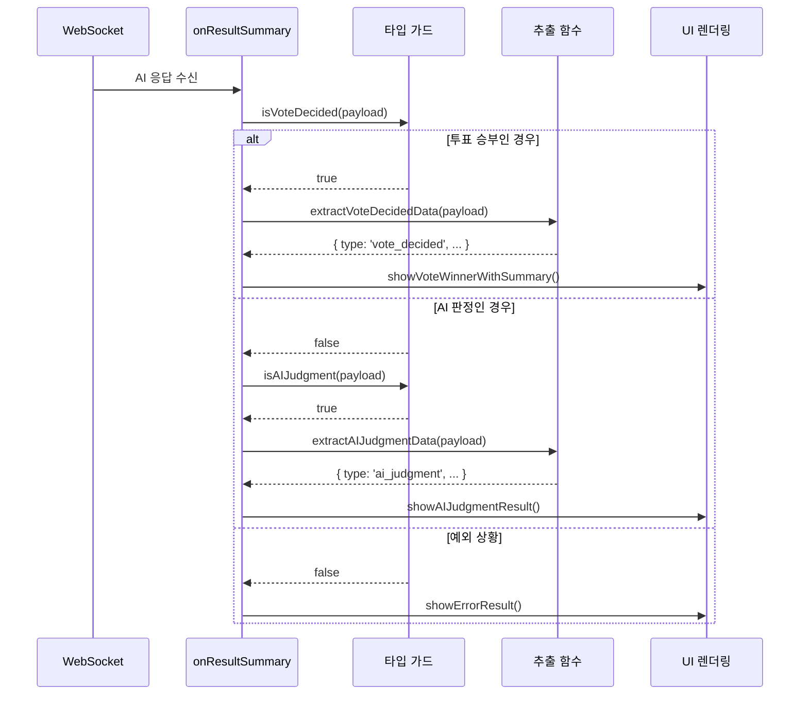
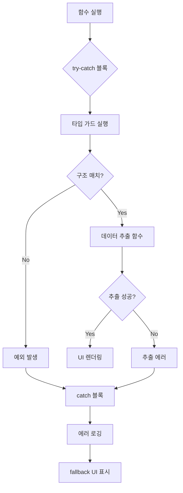

# **🤖 AI 최종 판정 처리 가이드**

## **📖 개요**

이 문서는 `/sub/debate/room/{roomId}/summaries/result` 경로로 받는 AI 최종 판정 데이터의 처리 방법을 설명합니다.

---

## **🔄 전체 흐름**

### **1. 투표 완료**
```
사용자들 투표 → 백엔드 집계 → 프론트엔드 /vote/end 수신
```

### **2. 백엔드 → AI 서버**  
```
백엔드: 투표 결과를 AI 서버에 전달
AI 서버: 투표 결과에 따라 다른 응답 구조 선택
```

### **3. AI 서버 → 프론트엔드**
```
백엔드: AI 응답을 그대로 전달
프론트엔드: /summaries/result 수신 → 구조 분석 → UI 렌더링
```

---

## **🔄 함수 흐름도**

### **전체 처리 흐름**


### **타입 가드 함수 흐름**


### **데이터 추출 함수 흐름**
```mermaid
flowchart TD
    A[extractVoteDecidedData] --> B[payload.full_summarize 추출]
    B --> C[방어적 파싱: || {}]
    C --> D[num1, num2 추출: || '']
    D --> E[반환 객체 생성]
    E --> F[type: 'vote_decided']
    
    G[extractAIJudgmentData] --> H[payload.result 추출]
    H --> I[각 필드별 방어적 파싱]
    I --> J[votes: || {}]
    I --> K[soft_scores: || {}]
    I --> L[details: || {}]
    I --> M[full_summarize: || {}]
    
    J --> N[반환 객체 생성]
    K --> N
    L --> N
    M --> N
    
    N --> O[type: 'ai_judgment']
```

### **실제 사용 시 함수 호출 순서**


### **에러 처리 흐름**


---

## **📊 AI 응답 구조 종류**

### **🏆 투표 승부 응답** (`VoteDecidedResponse`)
**언제**: 투표에서 이미 승부가 결정된 경우  
**AI 역할**: 요약만 제공

```typescript
interface VoteDecidedResponse {
  full_summarize: {
    num1: string;    // 승리팀 종합 요약
    num2: string;    // 패배팀 종합 요약
  }
}
```

**예시 데이터**:
```json
{
  "full_summarize": {
    "num1": "호랑이에 대한 찬성을 주장하는 사람의 의견 종합 요약: 호랑이는 강력하고 독립적인 성격으로...",
    "num2": "호랑이에 대한 반대를 주장하는 사람의 의견 종합 요약: 호랑이는 위험하고 관리가 어려워..."
  }
}
```

### **⚖️ AI 판정 응답** (`AIJudgmentResponse`)  
**언제**: 투표에서 무승부가 나온 경우  
**AI 역할**: 승부 판정 + 상세 분석

```typescript
interface AIJudgmentResponse {
  result: {
    winner: string;                           // "num1" 또는 "num2" (AI 최종 판정)
    votes: { num1: number; num2: number };    // 백엔드가 전달한 투표 결과 (무승부)
    soft_scores: { num1: number; num2: number }; // AI 계산 점수
    details: {
      juror: number;    // 심사위원 번호
      vote: string;     // AI 투표
      sim1: number;     // 유사도 1
      sim2: number;     // 유사도 2
      diff: number;     // 차이값
    };
    juror_explain: string;                    // AI 판정 근거 설명
    full_summarize: {
      num1: string;                           // num1 팀 종합 요약
      num2: string;                           // num2 팀 종합 요약
    };
  }
}
```

**예시 데이터**:
```json
{
  "result": {
    "winner": "num1",
    "votes": { "num1": 2, "num2": 2 },
    "soft_scores": { "num1": 85, "num2": 73 },
    "details": {
      "juror": 1,
      "vote": "num1",
      "sim1": 0.87542,
      "sim2": 0.73281,
      "diff": 0.14261
    },
    "juror_explain": "num1이 더 논리적이고 근거가 풍부했습니다. 특히 경제적 측면에서의 분석이 우수했습니다.",
    "full_summarize": {
      "num1": "호랑이에 대한 찬성 요약...",
      "num2": "호랑이에 대한 반대 요약..."
    }
  }
}
```

---

## **🔧 유틸 함수 API**

### **📂 파일 위치**
```
Front-end/src/utils/debateResult.ts
```

### **1. `isVoteDecided(payload)` - 타입 가드**

#### **타입**
```typescript
function isVoteDecided(payload: any): payload is VoteDecidedResponse
```

#### **역할**  
AI 응답이 "투표 승부" 구조인지 판별합니다.

#### **매개변수**
- `payload: any` - `/summaries/result`에서 받은 원본 데이터

#### **반환값**
- `boolean` - 투표 승부 응답이면 `true`, 아니면 `false`

#### **사용 예시**
```typescript
stt.onResultSummary((payload: any) => {
  if (isVoteDecided(payload)) {
    console.log("투표에서 승부 결정됨!");
    // 투표 승부 처리 로직
  }
});
```

---

### **2. `isAIJudgment(payload)` - 타입 가드**

#### **타입**
```typescript
function isAIJudgment(payload: any): payload is AIJudgmentResponse
```

#### **역할**
AI 응답이 "AI 판정" 구조인지 판별합니다.

#### **매개변수**
- `payload: any` - `/summaries/result`에서 받은 원본 데이터

#### **반환값**
- `boolean` - AI 판정 응답이면 `true`, 아니면 `false`

#### **사용 예시**
```typescript
stt.onResultSummary((payload: any) => {
  if (isAIJudgment(payload)) {
    console.log("AI가 무승부 판정함!");
    // AI 판정 처리 로직
  }
});
```

---

### **3. `extractVoteDecidedData(payload)` - 데이터 추출**

#### **타입**
```typescript
function extractVoteDecidedData(payload: VoteDecidedResponse): {
  type: 'vote_decided';
  scenario: string;
  num1Summary: string;
  num2Summary: string;
}
```

#### **역할**
투표 승부 응답에서 UI 렌더링에 필요한 데이터를 안전하게 추출합니다.

#### **매개변수**
- `payload: VoteDecidedResponse` - 투표 승부 응답 데이터

#### **반환값**
```typescript
{
  type: 'vote_decided',                     // 응답 타입 식별자
  scenario: '투표에서 승부 결정 → AI 요약 제공',  // 시나리오 설명
  num1Summary: string,                      // num1 팀 요약
  num2Summary: string                       // num2 팀 요약
}
```

#### **사용 예시**
```typescript
if (isVoteDecided(payload)) {
  const data = extractVoteDecidedData(payload);
  
  // UI 업데이트
  updateResultUI({
    type: data.type,
    leftTeamSummary: data.num1Summary,
    rightTeamSummary: data.num2Summary
  });
}
```

---

### **4. `extractAIJudgmentData(payload)` - 데이터 추출**

#### **타입**
```typescript
function extractAIJudgmentData(payload: AIJudgmentResponse): {
  type: 'ai_judgment';
  scenario: string;
  aiWinner: string;
  originalVotes: { num1: number; num2: number };
  aiScores: { num1: number; num2: number };
  judgmentReason: string;
  details: {
    juror: number;
    vote: string;
    sim1: number;
    sim2: number;
    diff: number;
  };
  num1Summary: string;
  num2Summary: string;
}
```

#### **역할**
AI 판정 응답에서 UI 렌더링에 필요한 데이터를 안전하게 추출합니다.

#### **매개변수**
- `payload: AIJudgmentResponse` - AI 판정 응답 데이터

#### **반환값**
```typescript
{
  type: 'ai_judgment',                      // 응답 타입 식별자
  scenario: '투표 무승부 → AI 승부 판정',      // 시나리오 설명
  aiWinner: string,                         // AI가 정한 승리자 ("num1" | "num2")
  originalVotes: {                          // 원본 투표 결과 (무승부였음)
    num1: number,
    num2: number
  },
  aiScores: {                               // AI 계산 점수
    num1: number,
    num2: number
  },
  judgmentReason: string,                   // AI 판정 근거 설명
  details: {                                // 상세 분석 데이터
    juror: number,
    vote: string,
    sim1: number,
    sim2: number,
    diff: number
  },
  num1Summary: string,                      // num1 팀 요약
  num2Summary: string                       // num2 팀 요약
}
```

#### **사용 예시**
```typescript
if (isAIJudgment(payload)) {
  const data = extractAIJudgmentData(payload);
  
  // UI 업데이트
  updateResultUI({
    type: data.type,
    originalVote: '무승부',
    aiWinner: data.aiWinner === 'num1' ? '좌측' : '우측',
    aiReason: data.judgmentReason,
    aiScores: data.aiScores,
    leftTeamSummary: data.num1Summary,
    rightTeamSummary: data.num2Summary
  });
}
```

---

### **5. `analyzeAIResponse(payload)` - 디버깅**

#### **타입**
```typescript
function analyzeAIResponse(payload: any): void
```

#### **역할**
개발 및 테스트 시 AI 응답 구조를 콘솔에 분석하여 출력합니다.

#### **매개변수**
- `payload: any` - 분석할 AI 응답 데이터

#### **반환값**
- `void` - 콘솔 출력만 수행

#### **출력 예시**
```
🔍 /summaries/result 응답 분석
  원본 AI 응답: { full_summarize: { ... } }
  ✅ 투표 승부 응답 (AI 요약만)
  데이터: { type: 'vote_decided', scenario: '...', ... }
```

#### **사용 예시**
```typescript
stt.onResultSummary((payload: any) => {
  // 개발 모드에서만 분석
  if (process.env.NODE_ENV === 'development') {
    analyzeAIResponse(payload);
  }
  
  // 실제 처리 로직
  if (isVoteDecided(payload)) {
    // ...
  }
});
```

---

## **🎯 사용 패턴**

### **기본 사용법**
```typescript
import { 
  isVoteDecided, 
  isAIJudgment, 
  extractVoteDecidedData, 
  extractAIJudgmentData 
} from '@/utils/debateResult';

stt.onResultSummary((payload: any) => {
  console.log("AI 최종 판정 수신:", payload);
  
  if (isVoteDecided(payload)) {
    // 투표에서 승부 → AI 요약만
    const data = extractVoteDecidedData(payload);
    showVoteWinnerWithSummary(data);
    
  } else if (isAIJudgment(payload)) {
    // 투표 무승부 → AI 판정
    const data = extractAIJudgmentData(payload);
    showAIJudgmentResult(data);
    
  } else {
    // 예외 상황
    console.warn("알 수 없는 AI 응답 구조:", payload);
    showErrorResult(payload);
  }
});
```

### **방어적 사용법**
```typescript
stt.onResultSummary((payload: any) => {
  try {
    // 디버깅 (개발 모드)
    if (process.env.NODE_ENV === 'development') {
      analyzeAIResponse(payload);
    }
    
    // 구조 분석 및 처리
    if (isVoteDecided(payload)) {
      const data = extractVoteDecidedData(payload);
      handleVoteDecided(data);
    } else if (isAIJudgment(payload)) {
      const data = extractAIJudgmentData(payload);
      handleAIJudgment(data);
    } else {
      throw new Error('Unknown AI response structure');
    }
    
  } catch (error) {
    console.error('AI 응답 처리 오류:', error);
    // 에러 시 fallback 처리
    handleAIResponseError(payload, error);
  }
});
```

---

## **⚠️ 주의사항**

### **1. 타입 안전성**
- 반드시 타입 가드 함수(`isVoteDecided`, `isAIJudgment`)를 먼저 사용하세요
- 타입 가드 통과 후에만 해당 추출 함수를 사용하세요

### **2. 방어적 프로그래밍**  
- 모든 데이터 추출 함수는 내부적으로 방어적 파싱을 적용합니다
- `undefined`나 `null` 값에 대해 안전한 기본값을 제공합니다

### **3. 에러 처리**
- 예상하지 못한 구조가 올 수 있으므로 `try-catch` 사용을 권장합니다
- 에러 발생 시 사용자에게 적절한 fallback UI를 제공하세요

### **4. 성능 고려사항**
- `analyzeAIResponse`는 개발 모드에서만 사용하세요
- 프로덕션에서는 불필요한 콘솔 출력을 피하세요

---

## **🔄 업데이트 이력**

- **v1.0.0** (2024-01-15): 초기 AI 최종 판정 처리 시스템 구현
  - `VoteDecidedResponse`, `AIJudgmentResponse` 타입 정의
  - 타입 가드 및 데이터 추출 함수 구현
  - 디버깅 유틸리티 함수 추가
