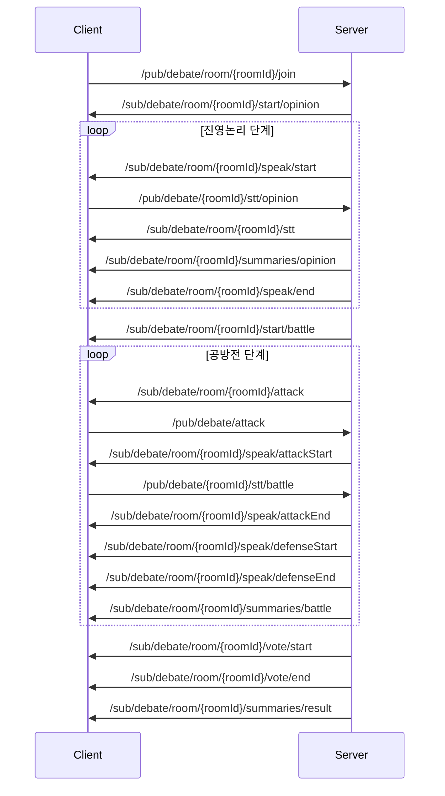

# 🗣️ Debate WebSocket API 문서

## 📡 개요

토론방 시스템에서 사용하는 WebSocket 통신 API 문서입니다.  
실시간 토론 진행, STT, AI 요약, 채팅 등의 기능을 제공합니다.

**연결 정보**
- **서버**: `VITE_DEBATE_WS_URL` 환경변수
- **프로토콜**: STOMP over WebSocket
- **인증**: `Authorization: Bearer {token}` 헤더

## ⚙️ 환경변수 및 설정 위치

### **환경변수 설정 위치**

#### 1. **환경변수 파일** (.env.dev, .env.prod 등)
```bash
# 토론 WebSocket 서버 (현재 미정의 - 수동 설정 필요)
VITE_DEBATE_WS_URL=ws://localhost:8083

# 기타 WebSocket 서버들 (참고용)
VITE_MATCH_WS_URL=ws://localhost:8081    # 매칭 서버
VITE_STT_WS_URL=ws://localhost:8082      # STT 서버  
VITE_WS_BASE_URL=ws://localhost:8080     # WebRTC 서버
```

#### 2. **설정 파일**: `Front-end/src/config/env.ts` (4-16번 줄)
```typescript
// 현재 VITE_DEBATE_WS_URL은 정의되지 않음 - 추가 필요
export const config = {
  // 메인 서버 (OAuth, 인증, 주제)
  MAIN_API_URL: import.meta.env.VITE_MAIN_API_URL ?? 'http://localhost:8080',
  
  // 매칭 서버 (매칭, WebSocket) 
  MATCH_WS_URL: (import.meta.env.VITE_MATCH_WS_URL ?? 'ws://localhost:8081'),
  
  // STT 서버 (음성 인식, WebSocket)
  STT_WS_URL: (import.meta.env.VITE_STT_WS_URL ?? 'ws://localhost:8082'),
  
  // TODO: 토론 WebSocket 서버 설정 추가 필요
  // DEBATE_WS_URL: import.meta.env.VITE_DEBATE_WS_URL ?? 'ws://localhost:8083',
}
```

### **실제 연결 코드 위치**

#### **토론 WebSocket 연결**: `Front-end/src/pages/DebateRoom.vue` (2877번 줄)
```typescript
debateClient.value = new Client({
  brokerURL: `${import.meta.env.VITE_DEBATE_WS_URL}/ws`,  // 직접 환경변수 사용
  connectHeaders: {
    Authorization: `Bearer ${authToken}`,
    login: currentUserEmail,
  }
});
```

#### **기타 WebSocket 연결들**:
- **매칭**: `Front-end/src/composables/useWebSocket.ts` (24번 줄)
- **WebRTC**: `Front-end/src/composables/useWebRTCConnection.ts` (108, 206번 줄)

### **🔧 환경변수 변경이 필요한 경우**

#### **설정 변경 순서**:

1. **환경변수 파일 수정** (.env.dev, .env.prod 등)
   ```bash
   VITE_DEBATE_WS_URL=ws://새로운서버주소:포트
   ```

2. **config/env.ts 파일에 설정 추가** (권장)
   ```typescript
   // Front-end/src/config/env.ts에 추가
   export const config = {
     // ... 기존 설정들
     DEBATE_WS_URL: import.meta.env.VITE_DEBATE_WS_URL ?? 'ws://localhost:8083',
   }
   ```

3. **DebateRoom.vue에서 config 사용하도록 변경** (권장)
   ```typescript
   // Front-end/src/pages/DebateRoom.vue 2877번 줄 수정
   import { config } from '@/config/env'
   
   brokerURL: `${config.DEBATE_WS_URL}/ws`,  // 통일된 설정 사용
   ```

#### **현재 상태 및 개선 필요사항**:
- ❌ `VITE_DEBATE_WS_URL` 환경변수가 정의되지 않음
- ❌ `config/env.ts`에 토론 WebSocket 설정 누락
- ❌ DebateRoom.vue에서 직접 환경변수 사용 (일관성 부족)

#### **권장 개선사항**:
1. 환경변수 파일에 `VITE_DEBATE_WS_URL` 추가
2. `config/env.ts`에 `DEBATE_WS_URL` 설정 추가
3. DebateRoom.vue에서 config import 후 사용

---

## 📤 발행 (Publish) 경로

### 1. 토론방 입장
```
POST /pub/debate/room/{roomId}/join
```
**데이터 구조**:
```json
{
  "roomId": "string",
  "userEmail": "string",
  "nickname": "string"
}
```

### 2. 공격 대상 선택
```
POST /pub/debate/attack
```
**데이터 구조**:
```json
{
  "roomId": "string", 
  "target": "string"  // 공격 대상 userId
}
```

### 3. 채팅 메시지 전송
```
POST /pub/debate/chat
```
**데이터 구조**:
```json
{
  "roomId": "string",
  "nickname": "string",
  "message": "string"
}
```

### 4. STT 텍스트 전송

#### 진영논리 단계
```
POST /pub/debate/{roomId}/stt/opinion
```

#### 공방전 단계
```
POST /pub/debate/{roomId}/stt/battle
```

**데이터 구조**:
```json
{
  "text": "string"  // STT로 변환된 텍스트
}
```

---

## 📡 구독 (Subscribe) 경로

### 1. 토론 진행 단계

#### 진영논리 시작
```
SUB /sub/debate/room/{roomId}/start/opinion
```
**응답 데이터**:
```json
{
  "stage": "opinion",
  "startTime": "2024-01-01T10:00:00Z",
  "duration": 60000  // 제한시간 (ms)
}
```

#### 발언 시작
```
SUB /sub/debate/room/{roomId}/speak/start
```
**응답 데이터**:
```json
{
  "speaker": "user@email.com",  // 발언자
  "startTime": "2024-01-01T10:00:00Z",
  "duration": 60000,
  "stage": "opinion"  // 토론 단계
}
```

#### 발언 종료
```
SUB /sub/debate/room/{roomId}/speak/end
```
**응답 데이터**:
```json
{
  "speaker": "user@email.com",
  "endTime": "2024-01-01T10:01:00Z",
  "stage": "opinion"
}
```

### 2. 공방전 시스템

#### 공방전 시작
```
SUB /sub/debate/room/{roomId}/start/battle
```
**응답 데이터**:
```json
{
  "stage": "battle",
  "startTime": "2024-01-01T10:05:00Z",
  "selectTime": 30000  // 대상 선택 시간 (ms)
}
```

#### 공격 대상 선택 결과
```
SUB /sub/debate/room/{roomId}/attack
```
**응답 데이터**:
```json
{
  "attacker": "user01@email.com",
  "target": "user02@email.com",
  "selectedTime": "2024-01-01T10:05:30Z"
}
```

#### 공격 발언 시작/종료
```
SUB /sub/debate/room/{roomId}/speak/attackStart
SUB /sub/debate/room/{roomId}/speak/attackEnd
```
**응답 데이터**:
```json
{
  "speaker": "user01@email.com",  // 공격자
  "target": "user02@email.com",   // 대상
  "startTime": "2024-01-01T10:05:30Z",
  "duration": 90000
}
```

#### 방어 발언 시작/종료
```
SUB /sub/debate/room/{roomId}/speak/defenseStart
SUB /sub/debate/room/{roomId}/speak/defenseEnd
```
**응답 데이터**:
```json
{
  "speaker": "user02@email.com",  // 방어자
  "attacker": "user01@email.com", // 공격자
  "startTime": "2024-01-01T10:07:00Z",
  "duration": 90000
}
```

### 3. 투표 시스템

#### 투표 시작
```
SUB /sub/debate/room/{roomId}/vote/start
```
**응답 데이터**:
```json
{
  "voteStartTime": "2024-01-01T10:10:00Z",
  "duration": 30000,  // 투표 제한시간
  "topic": "토론 주제"
}
```

#### 투표 종료
```
SUB /sub/debate/room/{roomId}/vote/end
```
**응답 데이터**:
```json
{
  "voteResult": 0,  // 0=좌측승, 1=우측승, 2=무승부
  "voteInfo": {     // 참가자별 투표 결과
    "user01@email.com": 0,
    "user02@email.com": 1,
    "user03@email.com": 0
  },
  "endTime": "2024-01-01T10:10:30Z"
}
```

### 4. 채팅 시스템

```
SUB /sub/debate/room/{roomId}/chat
```
**응답 데이터**:
```json
{
  "nickname": "사용자명",
  "text": "채팅 메시지",
  "team": 0,  // 0=좌측, 1=우측, null=시청자
  "timestamp": "2024-01-01T10:00:00Z"
}
```

### 5. STT (음성인식) 시스템

#### STT 브로드캐스트
```
SUB /sub/debate/room/{roomId}/stt
SUB /debate/room/{roomId}/stt  (fallback)
```
**응답 데이터**:
```json
{
  "user": "user@email.com",  // 발언자
  "text": "실시간 변환된 음성 텍스트"
}
```

#### AI 요약 - 진영논리
```
SUB /sub/debate/room/{roomId}/summaries/opinion
SUB /sub/debate/room/{roomId}/summaries/opinion{roomId}  (fallback)
```
**응답 데이터**:
```json
{
  "result": {
    "text": "AI가 요약한 발언 내용"
  },
  "user": "user@email.com"  // 발언자 (선택사항)
}
```

#### AI 요약 - 공방전
```
SUB /sub/debate/room/{roomId}/summaries/battle
```
**응답 데이터**:
```json
{
  "result": {
    "text": "공방전 발언에 대한 AI 요약"
  },
  "user": "user@email.com"
}
```

#### AI 요약 - 최종 결과
```
SUB /sub/debate/room/{roomId}/summaries/result
```
**응답 데이터**:
```json
{
  "result": {
    "winner": "num1",  // num1=좌측, num2=우측, tie=무승부
    "scores": {
      "team1": 7,
      "team2": 3
    },
    "summary": "토론 전체에 대한 AI 분석 및 요약"
  }
}
```

#### 시스템 알림 (선택사항)
```
SUB /sub/debate/{roomId}/system
```
**응답 데이터**:
```json
{
  "type": "notification",
  "message": "시스템 알림 메시지",
  "timestamp": "2024-01-01T10:00:00Z"
}
```

---

## 🎯 토론 진행 흐름



---

## 💡 구현 참고사항

### 클라이언트 연결
```javascript
import { Client } from '@stomp/stompjs';

const debateClient = new Client({
  brokerURL: `${process.env.VITE_DEBATE_WS_URL}/ws`,
  connectHeaders: {
    Authorization: `Bearer ${authToken}`
  },
  onConnect: (frame) => {
    console.log('토론 서버 연결 성공');
    subscribeToDebateRoom(debateClient);
  }
});

debateClient.activate();
```

### 메시지 구독 예시
```javascript
function subscribeToDebateRoom(client) {
  // 토론 진행 이벤트 구독
  client.subscribe(`/sub/debate/room/${roomId}/speak/start`, (message) => {
    const data = JSON.parse(message.body);
    handleSpeakStart(data);
  });
  
  // STT 브로드캐스트 구독
  client.subscribe(`/sub/debate/room/${roomId}/stt`, (message) => {
    const data = JSON.parse(message.body);
    displaySTTMessage(data.user, data.text);
  });
}
```

### 메시지 발행 예시
```javascript
// STT 텍스트 전송
client.publish({
  destination: `/pub/debate/${roomId}/stt/opinion`,
  body: JSON.stringify({ text: "변환된 음성 텍스트" })
});

// 채팅 메시지 전송
client.publish({
  destination: '/pub/debate/chat',
  body: JSON.stringify({
    roomId: roomId,
    nickname: "사용자명",
    message: "채팅 메시지"
  })
});
```

---

## 📋 요약

- **구독 경로**: 16개 (토론 진행, 공방전, 투표, 채팅, STT, AI 요약)
- **발행 경로**: 5개 (입장, 공격 선택, 채팅, STT)
- **실시간 기능**: 토론 진행, 음성인식, AI 요약, 채팅
- **인증**: Bearer Token 기반
- **프로토콜**: STOMP over WebSocket

이 API를 통해 실시간 토론의 모든 단계를 관리하고 참가자들 간의 상호작용을 지원합니다.
